# CMOS Logic Gates, Full Adder and Ripple-Carry Adder Design Using Cadence Virtuoso

## Project Summary

This repository documents a CMOS digital-circuit design project developed using **Cadence Virtuoso**. The project covers the design and simulation evidence for:

- CMOS AND gate
- CMOS OR gate
- CMOS XOR gate
- 1-bit full adder
- Multi-bit ripple-carry adder

The repository is intentionally organized as a **documentation-and-evidence repository**. The original editable Cadence Virtuoso project files, cell libraries, technology files/PDK, simulation setup files, and source databases are no longer available. Therefore, the screenshots included here are preserved as the available project evidence rather than being presented as a replacement for the original Cadence project.

> **Important:** No original Cadence database, Verilog/SystemVerilog source, PDK, technology file, simulation script, or generated project database has been fabricated or reconstructed.

---

## Objectives

1. Design basic CMOS logic gates in Cadence Virtuoso.
2. Create schematic representations of AND, OR and XOR logic.
3. Create corresponding transistor-level layouts for the available gates.
4. Build a 1-bit full adder from logic-gate blocks.
5. Create a full-adder testbench and capture transient simulation evidence.
6. Create a ripple-carry adder by cascading full-adder stages.
7. Create a ripple-carry adder testbench and capture simulation evidence.
8. Preserve schematic, layout, testbench and waveform screenshots in a GitHub-friendly structure.
9. Document the design flow and the limitations caused by the loss of the original editable project.

---

## Tools and Environment

The screenshots show use of the Cadence Virtuoso environment, including:

- **Virtuoso Schematic Editor XL** — schematic capture
- **Virtuoso Layout Suite XL** — physical layout
- **Virtuoso Visualization & Analysis XL** — waveform/result viewing

The screenshots also show transient simulation result views.

### Information intentionally not specified

The available screenshots do **not** provide sufficient evidence to safely state:

- technology node/process name
- exact PDK version
- transistor W/L values as a project-wide specification
- exact supply-voltage specification for the complete project
- measured propagation delay
- measured power consumption
- measured silicon/estimated area
- DRC pass status
- LVS pass status

Those details should be added only if the original project records or laboratory documentation are recovered.

---

## Circuits Included

### 1. CMOS AND Gate

The repository contains:

- AND-gate transistor-level schematic
- AND-gate layout

The schematic screenshot shows the CMOS pull-up/pull-down transistor network and input/output connections. The corresponding layout screenshot provides the available physical-design evidence.

[View AND schematic](screenshots/schematics/01_and_gate_schematic.png)  
[View AND layout](screenshots/layouts/02_and_gate_layout.png)

### 2. CMOS OR Gate

The repository contains:

- OR-gate transistor-level schematic
- OR-gate layout

[View OR schematic](screenshots/schematics/03_or_gate_schematic.png)  
[View OR layout](screenshots/layouts/04_or_gate_layout.png)

### 3. CMOS XOR Gate

The repository contains:

- XOR-gate transistor-level schematic
- XOR-gate layout

[View XOR schematic](screenshots/schematics/05_xor_gate_schematic.png)  
[View XOR layout](screenshots/layouts/06_xor_gate_layout.png)

### 4. 1-Bit Full Adder

The full-adder section includes:

- full-adder schematic
- full-adder testbench schematic
- transient waveform screenshot
- extracted/post-layout waveform evidence
- full-adder layout

A conventional full adder has three inputs:

- `A`
- `B`
- `Cin`

and two outputs:

- `Sum`
- `Cout`

Its logical relationships are:

```text
Sum  = A XOR B XOR Cin
Cout = AB + Cin(A XOR B)
```

The equations are included here as the standard functional description of a full adder; they are not being presented as reconstructed source code from the unavailable project.

[Full-adder schematic](screenshots/schematics/07_full_adder_schematic.png)  
[Full-adder testbench](screenshots/testbench/08_full_adder_testbench_schematic.png)  
[Full-adder waveform](screenshots/simulation/09_full_adder_testbench_waveform.png)  
[Full-adder layout](screenshots/layouts/11_full_adder_layout.png)  
[Extracted waveform evidence](screenshots/simulation/12_full_adder_extracted_waveform.png)

### 5. Ripple-Carry Adder

The repository contains evidence for a cascaded ripple-carry adder:

- ripple-carry adder schematic
- ripple-carry adder testbench schematic
- ripple-carry simulation waveform
- extracted waveform evidence

A ripple-carry adder cascades full-adder stages so that the carry generated by one stage becomes the carry input of the next stage. The arrangement makes the carry path propagate through successive stages.

[View ripple-carry schematic](screenshots/schematics/13_ripple_carry_adder_schematic.png)  
[View ripple-carry testbench](screenshots/testbench/14_ripple_carry_testbench_schematic.png)  
[View ripple-carry waveform](screenshots/simulation/15_ripple_carry_testbench_waveform.png)  
[View extracted waveform evidence](screenshots/simulation/10_ripple_carry_extracted_waveform.png)

---

## Design Methodology

The available evidence represents the following overall design flow:

```text
CMOS Logic Gate Design
        |
        +--> AND schematic --> AND layout
        |
        +--> OR schematic  --> OR layout
        |
        +--> XOR schematic --> XOR layout
        |
        v
1-Bit Full Adder
        |
        +--> Full-adder schematic
        |
        +--> Testbench
        |
        +--> Transient simulation
        |
        +--> Layout / extracted simulation evidence
        |
        v
Ripple-Carry Adder
        |
        +--> Cascaded full-adder stages
        |
        +--> Testbench
        |
        +--> Transient simulation
        |
        +--> Extracted simulation evidence
```

The screenshots document the design at schematic, layout, testbench and waveform levels. They do not preserve the editable design database required to reproduce the project directly in Cadence.

---

## Repository Evidence

### Schematics

| Circuit | Evidence |
|---|---|
| AND | `screenshots/schematics/01_and_gate_schematic.png` |
| OR | `screenshots/schematics/03_or_gate_schematic.png` |
| XOR | `screenshots/schematics/05_xor_gate_schematic.png` |
| Full Adder | `screenshots/schematics/07_full_adder_schematic.png` |
| Ripple-Carry Adder | `screenshots/schematics/13_ripple_carry_adder_schematic.png` |

### Layouts

| Circuit | Evidence |
|---|---|
| AND | `screenshots/layouts/02_and_gate_layout.png` |
| OR | `screenshots/layouts/04_or_gate_layout.png` |
| XOR | `screenshots/layouts/06_xor_gate_layout.png` |
| Full Adder | `screenshots/layouts/11_full_adder_layout.png` |

### Testbenches

| Circuit | Evidence |
|---|---|
| Full Adder | `screenshots/testbench/08_full_adder_testbench_schematic.png` |
| Ripple-Carry Adder | `screenshots/testbench/14_ripple_carry_testbench_schematic.png` |

### Simulation Evidence

| Evidence | File |
|---|---|
| Full-adder transient waveform | `screenshots/simulation/09_full_adder_testbench_waveform.png` |
| Ripple-carry extracted waveform | `screenshots/simulation/10_ripple_carry_extracted_waveform.png` |
| Full-adder extracted waveform | `screenshots/simulation/12_full_adder_extracted_waveform.png` |
| Ripple-carry testbench waveform | `screenshots/simulation/15_ripple_carry_testbench_waveform.png` |

The filenames are descriptive reorganizations of the supplied screenshots. The images themselves have not been edited to add, remove, or fabricate technical content.

---

## Simulation Evidence and Observations

The supplied waveform screenshots show transient voltage traces for the full-adder and ripple-carry-adder testbenches.

From the screenshots, the following can be documented safely:

- Input signals are driven through changing logic states.
- Corresponding `SUM` and/or `CARRY` output traces are displayed.
- The ripple-carry testbench exposes multiple sum-bit traces and a carry output.
- Separate screenshots are available for extracted/post-layout simulation evidence.
- The waveform views provide visual evidence of circuit response over simulation time.

No numerical delay, power, energy, area, noise margin, or other performance value is claimed in this repository because those values cannot be reliably recovered from the screenshots alone.

---

## Screenshot Gallery

### AND Gate

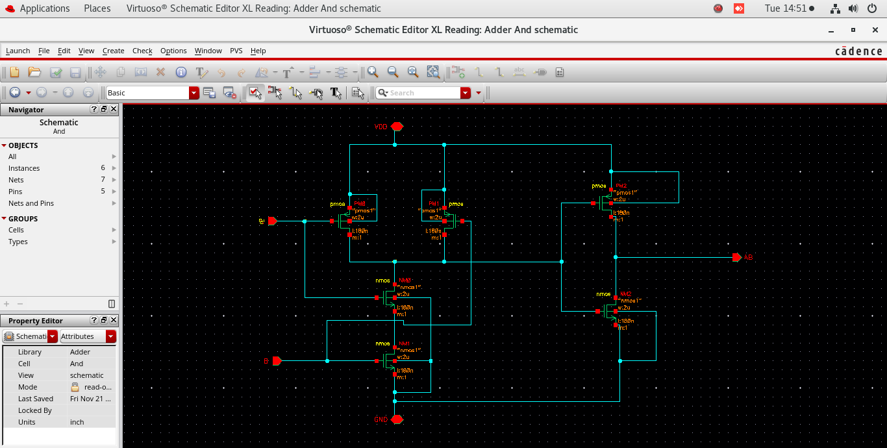

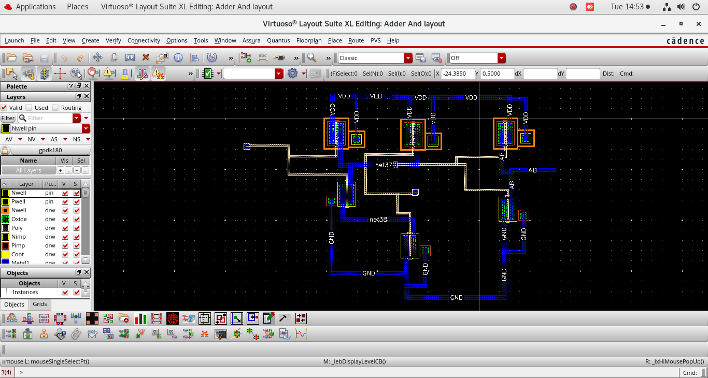

### OR Gate

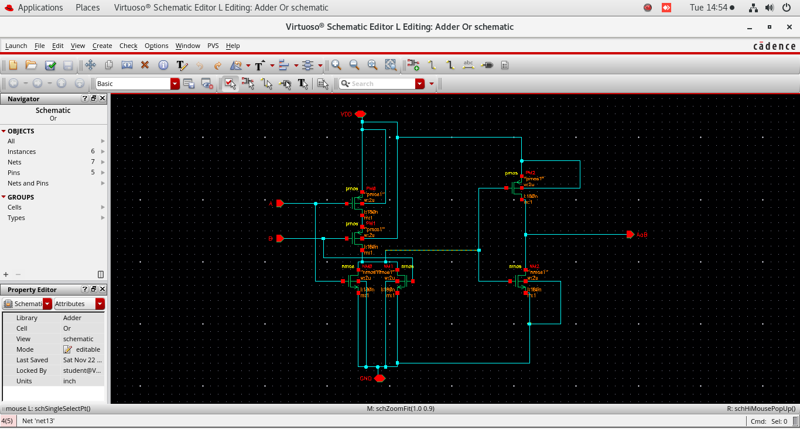

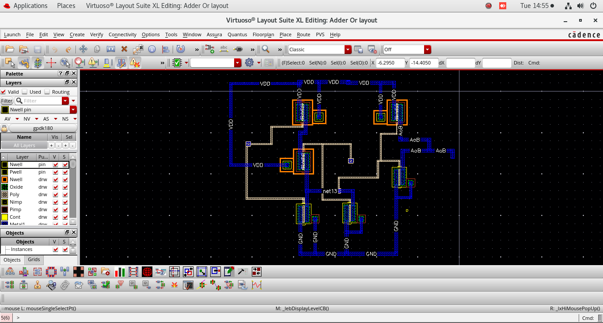

### XOR Gate

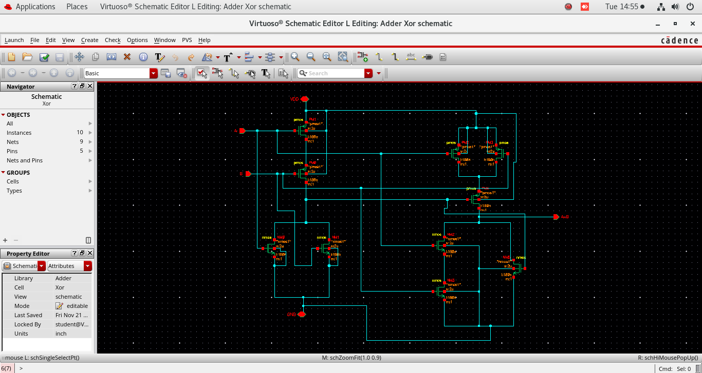

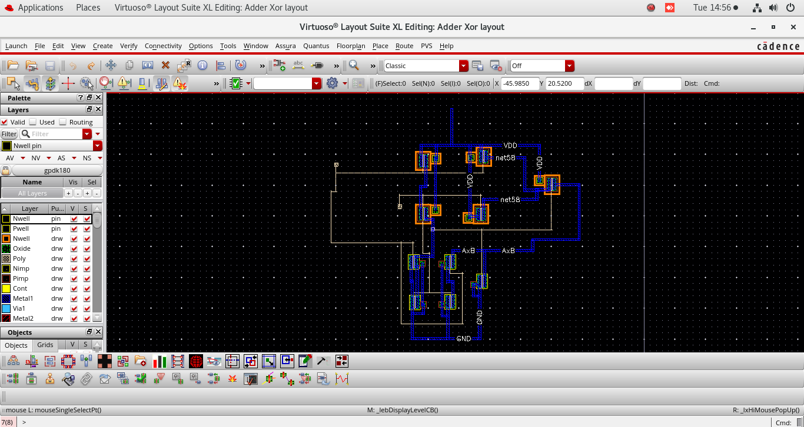

### Full Adder

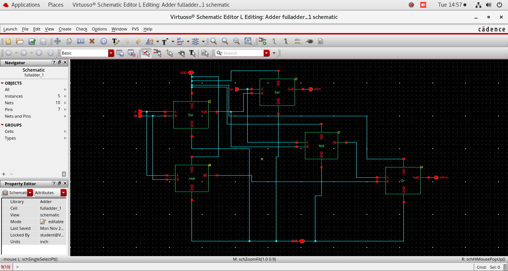

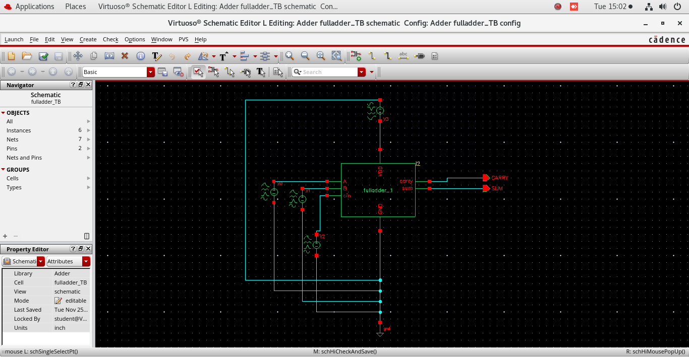

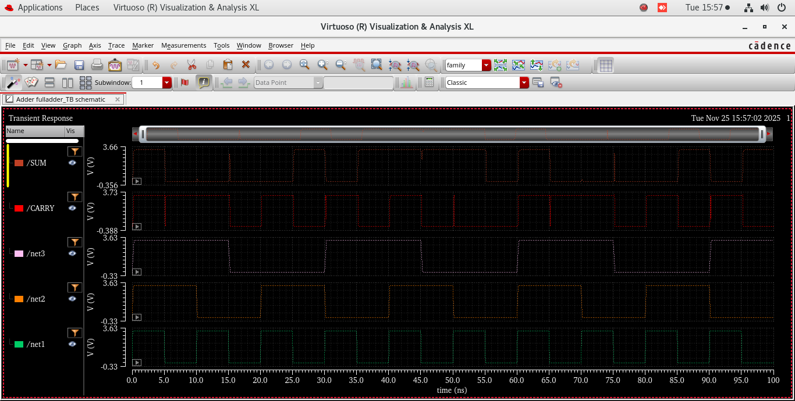

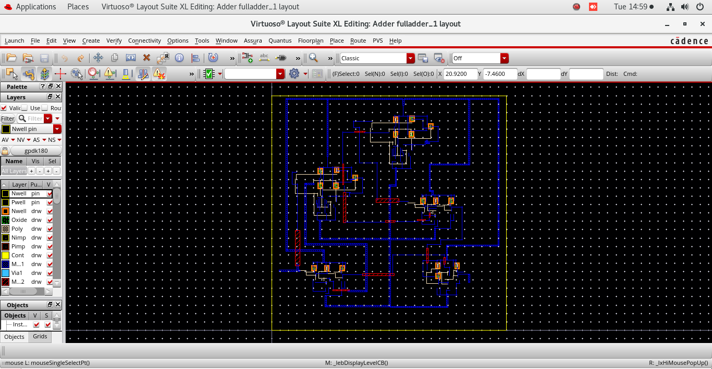

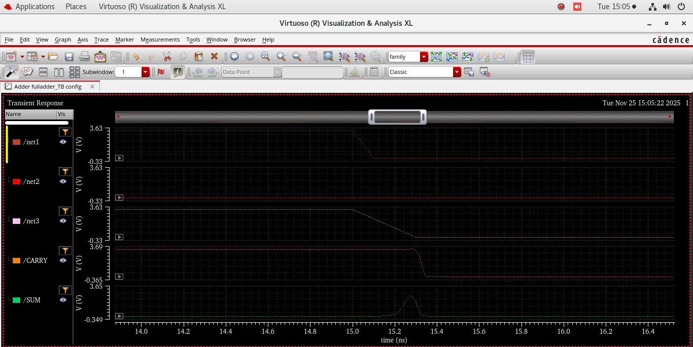

### Ripple-Carry Adder

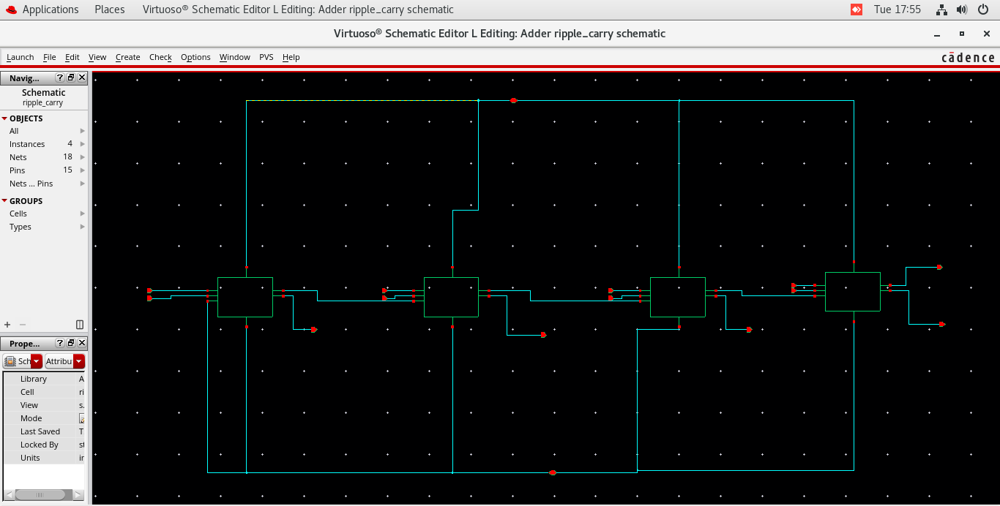

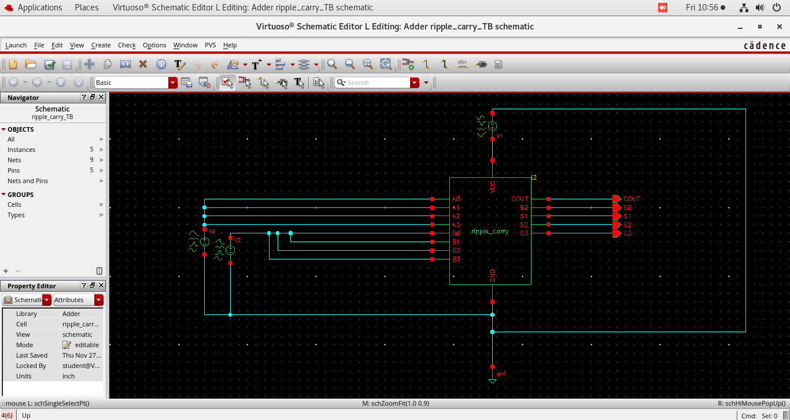

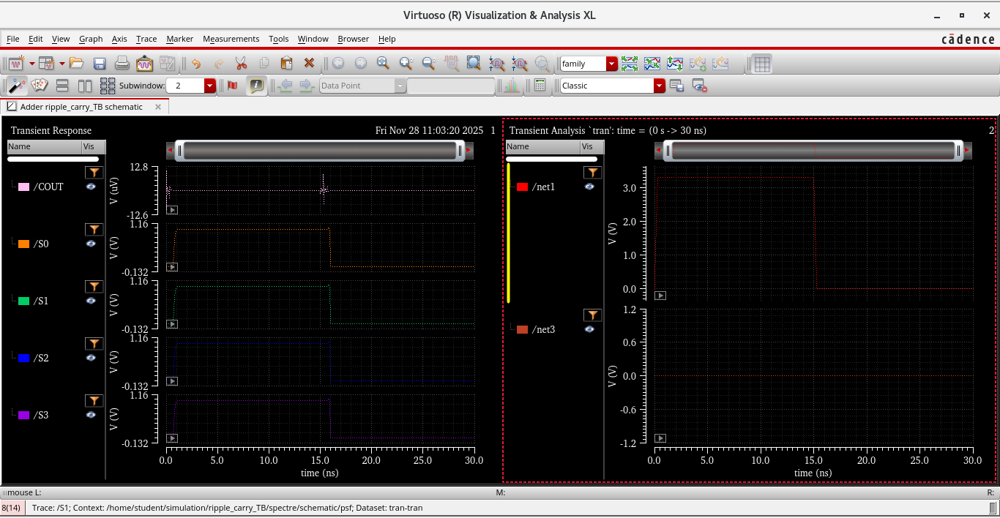

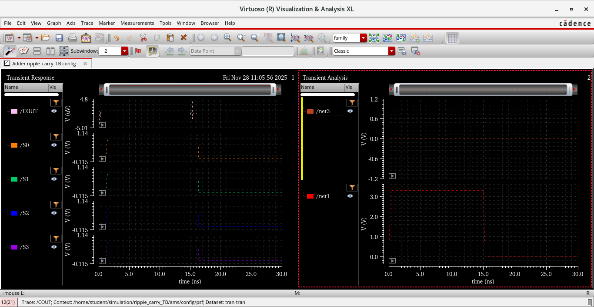

---

## Limitations

This repository is **not a replacement for the original Cadence Virtuoso project**.

The original editable files are unavailable, so this repository does not contain:

- Cadence library/cell/view databases
- Virtuoso design libraries
- PDK/technology files
- Technology setup files
- Original simulation configuration
- Original ADE state/configuration
- Netlists generated by the original project
- Original waveform/result databases
- Verilog/SystemVerilog source
- DRC/LVS reports
- Extracted parasitic files

The screenshots are preserved as evidence of the design work that was available at the time of repository creation.

### Ambiguous evidence

The two extracted-waveform screenshots were supplied with filenames referring to "AV extracted waveform." Their exact original analysis/configuration cannot be reconstructed from the screenshot alone, so the repository uses cautious names such as:

- `10_ripple_carry_extracted_waveform.png`
- `12_full_adder_extracted_waveform.png`

No stronger claim is made about the exact extraction methodology.

---

## Future Improvements

If the original Cadence project becomes available, this repository can be extended with:

1. Cadence library/cell/view source files where redistribution is permitted.
2. Original schematic and layout databases.
3. PDK/technology information, subject to licensing restrictions.
4. ADE simulation states and analysis configurations.
5. DRC reports and screenshots.
6. LVS reports and screenshots.
7. Extracted netlists/parasitics where appropriate.
8. Measured delay, power and area results.
9. A reproducible simulation workflow.
10. Additional test vectors and functional verification.
11. Detailed transistor sizing documentation.
12. A comparison of schematic-level and extracted/post-layout performance.

---

## Resume-Ready Project Description

> **CMOS Logic Gates, Full Adder and Ripple-Carry Adder Design — Cadence Virtuoso:** Designed and simulated CMOS AND, OR and XOR logic gates, developed a 1-bit full adder and cascaded full-adder stages to implement a ripple-carry adder using Cadence Virtuoso; created transistor-level schematics, physical layouts, testbenches and transient-simulation evidence, including extracted/post-layout waveform analysis.

---

## Repository Structure

```text
cadence_cmos_adders_github/
├── README.md
├── .gitignore
├── docs/
│   └── project_overview.md
├── screenshots/
│   ├── schematics/
│   │   ├── 01_and_gate_schematic.png
│   │   ├── 03_or_gate_schematic.png
│   │   ├── 05_xor_gate_schematic.png
│   │   ├── 07_full_adder_schematic.png
│   │   └── 13_ripple_carry_adder_schematic.png
│   ├── layouts/
│   │   ├── 02_and_gate_layout.png
│   │   ├── 04_or_gate_layout.png
│   │   ├── 06_xor_gate_layout.png
│   │   └── 11_full_adder_layout.png
│   ├── testbench/
│   │   ├── 08_full_adder_testbench_schematic.png
│   │   └── 14_ripple_carry_testbench_schematic.png
│   └── simulation/
│       ├── 09_full_adder_testbench_waveform.png
│       ├── 10_ripple_carry_extracted_waveform.png
│       ├── 12_full_adder_extracted_waveform.png
│       └── 15_ripple_carry_testbench_waveform.png
└── results/
    └── README.md
```

---

## License

No license file is included.

The repository contains screenshots originating from a Cadence Virtuoso project and potentially licensed technology/EDA environments. A permissive open-source license should **not** be assumed for those materials.

If you own the screenshots and all material you intend to publish, you can later add an appropriate license for your original documentation. Do not redistribute Cadence/PDK files or other third-party material unless their licensing terms permit it.
